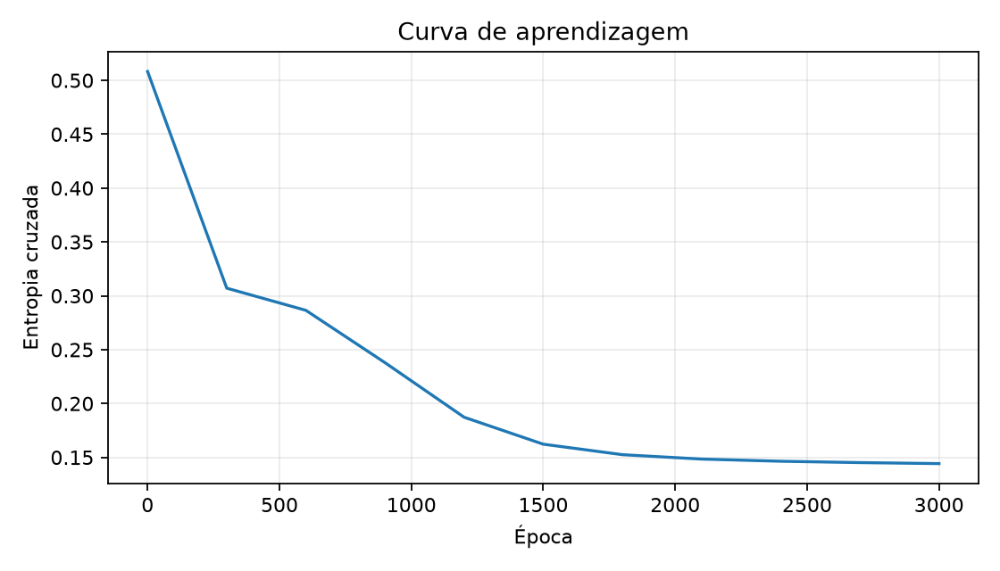
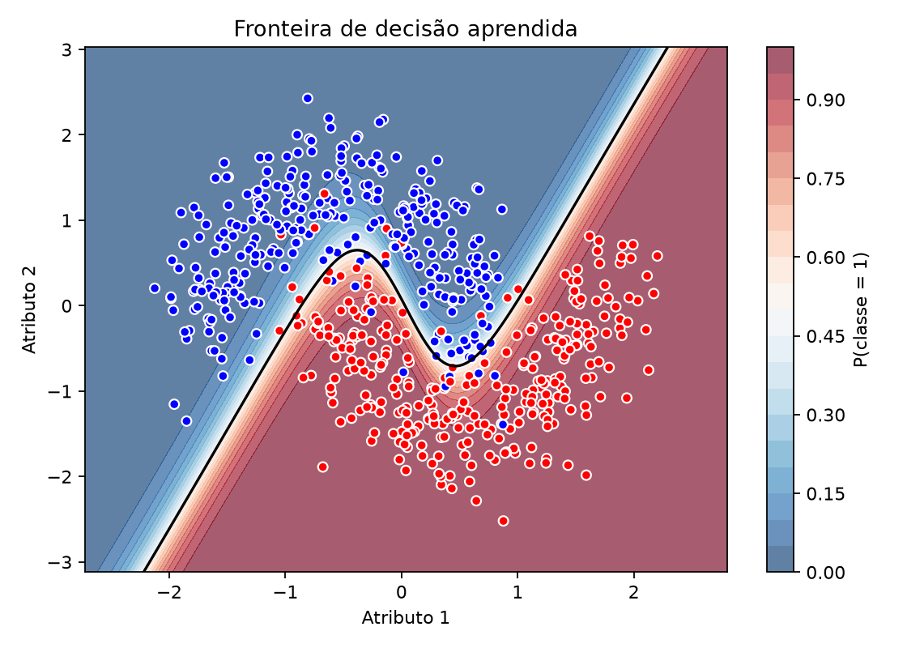

# Rede neural manual para classificação de dados não lineares

Projeto da disciplina **Matemática para Ciência de Dados**, desenvolvido a
partir do `exemplo4.py` da aula de 21/08/2026. O objetivo é mostrar, de forma
didática, a matemática da propagação direta e da retropropagação sem utilizar
frameworks prontos de redes neurais.

[Visualizar o notebook no GitHub](notebooks/projeto_rede_neural_manual.ipynb) ·
[](https://colab.research.google.com/github/pedroceciliocn/proj-mat-para-dl-pos/blob/main/notebooks/projeto_rede_neural_manual.ipynb)

## O que foi modificado em relação ao exemplo

| Elemento | `exemplo4.py` | Este projeto |
|---|---:|---:|
| Arquitetura manual | 2 → 2 → 1 | **2 → 8 → 4 → 1** |
| Camadas ocultas | 1 | **2** |
| Ativação oculta | sigmoide | **tanh** |
| Ativação de saída | sigmoide | sigmoide |
| Função de perda | erro quadrático | **entropia cruzada binária** |
| Quantidade de exemplos | 100 | **600** |
| Separação treino/teste | não | **sim (75%/25%)** |
| Inicialização | uniforme em [0, 1) | **Xavier** |
| Implementação | operações escalares | **operações matriciais explícitas** |

O conjunto `make_moons` foi mantido nesta primeira etapa para que o efeito das
alterações na rede possa ser comparado ao material da aula. O scikit-learn é
usado apenas para gerar e dividir os dados; ele **não** treina a rede.

## Matemática usada

Para uma camada qualquer, a combinação linear e a ativação são:

$$
\begin{aligned}
Z^{[l]} &= A^{[l-1]}W^{[l]} + b^{[l]}, \\
A^{[l]} &= \tanh\!\left(Z^{[l]}\right)
&& \text{nas camadas ocultas}, \\
\hat{y} = A^{[L]} &= \sigma\!\left(Z^{[L]}\right)
&& \text{na camada de saída},
\end{aligned}
$$

em que a função sigmoide é

$$
\sigma(z) = \frac{1}{1 + e^{-z}}.
$$

A perda para uma amostra de classe $y$ e probabilidade prevista $\hat{y}$ é a
entropia cruzada binária:

$$
\mathcal{L}(y, \hat{y}) =
-\left[y\log(\hat{y}) + (1-y)\log(1-\hat{y})\right].
$$

Com entropia cruzada e sigmoide na saída, o primeiro gradiente da
retropropagação se reduz a

$$
\delta^{[L]}
= \frac{\partial \mathcal{L}}{\partial Z^{[L]}}
= \hat{y} - y.
$$

Nas camadas ocultas aplica-se a regra da cadeia e a derivada
$\tanh'(z)=1-\tanh^2(z)$:

$$
\delta^{[l]} =
\left(\delta^{[l+1]}{W^{[l+1]}}^{\!T}\right)
\odot \left(1-{A^{[l]}}^2\right),
$$

em que $\odot$ representa o produto elemento a elemento. Por fim, os parâmetros
são atualizados por gradiente descendente com taxa de aprendizagem $\eta$:

$$
W^{[l]} \leftarrow W^{[l]} - \eta\,\frac{\partial \mathcal{L}}{\partial W^{[l]}},
\qquad
b^{[l]} \leftarrow b^{[l]} - \eta\,\frac{\partial \mathcal{L}}{\partial b^{[l]}}.
$$

O código correspondente está comentado em
[`src/rede_neural_manual.py`](src/rede_neural_manual.py).

## Requisitos

- Python 3.10 ou mais recente;
- [`uv`](https://docs.astral.sh/uv/getting-started/installation/) para gerenciar
  o ambiente e as dependências;
- VS Code com as extensões Python e Jupyter, caso o notebook seja executado
  pelo editor.

## Instalação com uv

Na raiz do projeto, sincronize o ambiente usando as versões registradas no
`uv.lock`:

```bash
uv sync --locked
```

O `uv` cria a `.venv` automaticamente. Não é necessário ativá-la: todo comando
pode ser executado com `uv run`.

## Executando o experimento

Para executar o treinamento completo:

```bash
uv run python executar_experimento.py
```

Os argumentos disponíveis podem ser consultados com
`uv run python executar_experimento.py -h`. Para um teste curto:

```bash
uv run python executar_experimento.py --epocas 500
```

## Resultados

O experimento reproduzível, executado com `seed = 42`, produziu os seguintes
resultados:

| Configuração/métrica | Valor |
|---|---:|
| Arquitetura | 2 → 8 → 4 → 1 |
| Épocas | 3.000 |
| Taxa de aprendizagem | 0,05 |
| Acurácia de treino | **95,33%** |
| Acurácia de teste | **95,33%** |
| Perda final de treino | **0,1442** |

A proximidade entre as acurácias de treino e teste indica que, nesta divisão dos
dados, a rede aprendeu a fronteira não linear sem apresentar uma diferença
relevante de generalização.

### Curva de aprendizagem



### Fronteira de decisão



Os resultados completos também estão disponíveis nos arquivos:

- `curva_aprendizagem.png`: evolução da perda no treino;
- `fronteira_decisao.png`: regiões que a rede atribui a cada classe;
- `metricas.json`: configuração e acurácias de treino e teste.

## Notebook

O mesmo notebook pode ser apenas visualizado no GitHub ou executado em um
ambiente hospedado pelo Google Colab:

- [Visualizar `projeto_rede_neural_manual.ipynb` no GitHub](notebooks/projeto_rede_neural_manual.ipynb);
- [Executar o notebook no Google Colab](https://colab.research.google.com/github/pedroceciliocn/proj-mat-para-dl-pos/blob/main/notebooks/projeto_rede_neural_manual.ipynb).

O link do Colab carrega diretamente o arquivo versionado neste repositório, de
modo que os dois acessos apresentam o mesmo código.

### Execução local no VS Code

Abra `notebooks/projeto_rede_neural_manual.ipynb`, clique em **Select Kernel**,
escolha **Python Environments** e selecione `.venv`. O workspace já contém a
configuração necessária para o VS Code localizar esse interpretador.

Se o ambiente não aparecer, execute **Developer: Reload Window** pela paleta de
comandos ou informe manualmente o caminho `.venv/bin/python`.

Também é possível registrar um kernelspec com um nome próprio:

```bash
uv run python -m ipykernel install --user \
  --name rede-neural-manual \
  --display-name "Python (rede-neural-manual)"
```

Nesse caso, selecione **Python (rede-neural-manual)**. Tanto `.venv` quanto esse
kernelspec apontam para o mesmo ambiente gerenciado pelo `uv`.

## Instalação alternativa com pip

Para ambientes sem `uv`:

```bash
python -m venv .venv
source .venv/bin/activate
python -m pip install -r requirements.txt
```
